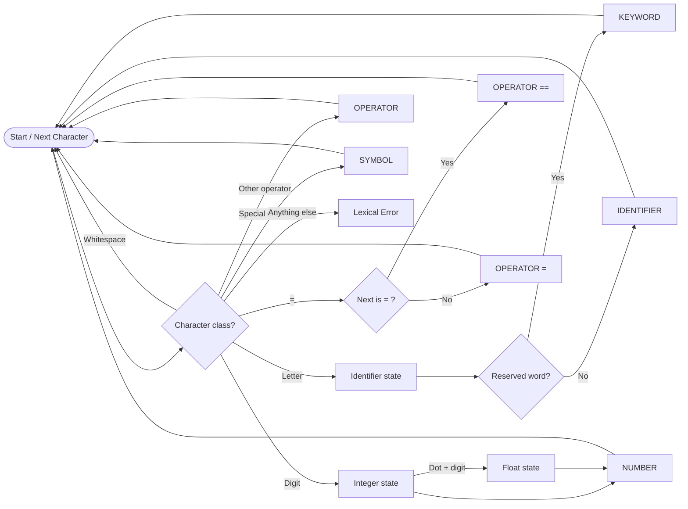

<div align="center">

# MiniLang Lexical Analyzer

**A deterministic lexical analyzer for a small programming language, implemented from scratch in modern C++26.**

<p>
  
  
  
  
</p>

**Theory of Automata · Complex Computing Problem**  
**Muhammad Wali Raza · 74752**

<sub>Finite automata · token recognition · longest-match scanning · lexical error detection · performance benchmarking</sub>

<br />

<a href="#overview">Overview</a> •
<a href="#language-specification">Language</a> •
<a href="#recognition-model">Model</a> •
<a href="#build-and-run">Build</a> •
<a href="#example">Example</a> •
<a href="#performance">Performance</a>

</div>

---

## Overview

This project implements a **lexical analyzer (lexer)** for a compact programming language. The analyzer reads source text from left to right, groups characters into lexemes, classifies each lexeme, and emits a token stream in the same order as the source program.

The scanner is written directly in C++ rather than delegating tokenization to a regular-expression library. Recognition is performed with deterministic, automata-style state transitions and explicit character tests, making the relationship between **regular languages, finite automata, and lexical analysis** visible in the implementation.

### Highlights

- Written in **C++26** with no third-party dependencies.
- Recognizes keywords, identifiers, operators, numbers, and special symbols.
- Distinguishes reserved words from identifiers after identifier recognition.
- Applies **longest-match** handling so `==` is recognized before `=`.
- Supports integer and floating-point numeric tokens.
- Rejects malformed floating-point literals and unsupported characters with useful positions.
- Includes multiple functional test cases and an integrated timing benchmark.
- Uses `std::string_view`, `std::unordered_set::contains`, strong token types, and exception-based lexical error reporting.

---

## Language Specification

| Token class | Recognized form | Examples |
|---|---|---|
| **Keyword** | `if`, `else`, `while`, `return` | `if`, `return` |
| **Identifier** | Starts with a letter, followed by letters or digits | `x`, `count1`, `value2` |
| **Operator** | `+`, `-`, `*`, `\`, `=`, `==` | `+`, `==` |
| **Number** | Integer or decimal number | `123`, `3.14` |
| **Symbol** | `(`, `)`, `;`, `{`, `}` | `(`, `;`, `}` |

The core token patterns can be expressed as:

```text
IDENTIFIER  = LETTER (LETTER | DIGIT)*
NUMBER      = DIGIT+ ('.' DIGIT+)?
KEYWORD     = if | else | while | return
OPERATOR    = + | - | * | \ | = | ==
SYMBOL      = ( | ) | ; | { | }
```

> **Keyword precedence:** a word is first scanned using the identifier pattern. The completed lexeme is then checked against the reserved-keyword set. For example, `if` becomes a keyword while `ifx` remains an identifier.

---

## Recognition Model

The implementation follows a deterministic scan: at each source position, the current character determines which recognizer is entered. Each recognizer consumes the **longest valid lexeme** before returning control to the main scan loop.



### Scanner flow

1. Ignore whitespace.
2. If a letter is found, consume all following letters/digits and classify the completed lexeme as a keyword or identifier.
3. If a digit is found, consume the integer part and optionally a valid decimal part.
4. Check `==` before `=` to preserve the longest-match rule.
5. Recognize the remaining single-character operators and symbols.
6. Report a lexical error when no valid token begins at the current position.

---

## Project Structure

```text
.
├── README.md
└── lexical_analyzer_cpp26.cpp
```

`lexical_analyzer_cpp26.cpp` contains the token model, lexical analyzer, output helpers, demonstration cases, error cases, and benchmark driver.

---

## Build and Run

### Requirements

A compiler with **C++26 / C++2c** support is required. The project has been verified with **GCC 14.2.0**.

### Linux / macOS

```bash
g++ -std=c++2c -O2 -Wall -Wextra -pedantic lexical_analyzer_cpp26.cpp -o lexer
./lexer
```

### Windows (GCC / MinGW)

```powershell
g++ -std=c++2c -O2 -Wall -Wextra -pedantic lexical_analyzer_cpp26.cpp -o lexer.exe
.\lexer.exe
```

The source intentionally contains a compile-time check for the selected language mode. If the compiler is not running in post-C++23 mode, compilation stops with a clear message.

---

## Example

Given the input:

```text
if (x == 10) return y + z;
```

The analyzer produces:

```text
[KEYWORD: if]
[SYMBOL: (]
[IDENTIFIER: x]
[OPERATOR: ==]
[NUMBER: 10]
[SYMBOL: )]
[KEYWORD: return]
[IDENTIFIER: y]
[OPERATOR: +]
[IDENTIFIER: z]
[SYMBOL: ;]
```

The executable also demonstrates cases involving `while`, floating-point numbers, assignment, keyword-prefix identifiers such as `ifx`, malformed decimals, and invalid characters.

### Using the analyzer from code

```cpp
LexicalAnalyzer lexer;
auto tokens = lexer.tokenize("while (count1 == 3.14) { count1 = count1 + 1; }");
print_tokens(tokens);
```

---

## Error Handling

The lexer deliberately rejects input that does not belong to the defined lexical language. For example:

```text
x = 3.;
```

produces a lexical error because the decimal point is not followed by a digit. Likewise, an unsupported character such as `@` is reported together with its source position rather than being silently ignored.

---

## Performance

For an input of length **n**, the main scanner advances monotonically through the source string. Each character is examined a constant number of times, giving the recognition pass an expected time complexity of:

<div align="center">

**O(n)** time · **O(t)** token-output space

</div>

where **t** is the total size of the emitted token stream. The executable includes a benchmark that generates increasingly large source programs and reports:

```text
Lines,Characters,Tokens,Time_ms
```

Each benchmark size is executed multiple times and the best measured duration is retained to reduce scheduler noise.

---

## Design Notes

**Why a direct scanner?**  
A direct deterministic scanner keeps token recognition close to the finite-automata model taught in Theory of Automata. State transitions are represented by explicit branches and loops instead of being hidden inside a regex engine.

**Why check `==` before `=`?**  
Both tokens begin with the same character. Testing the two-character token first implements the standard maximal-munch/longest-match rule and prevents `==` from becoming two assignment tokens.

**Why recognize identifiers before keywords?**  
Keywords obey the same character pattern as identifiers. Scanning the complete word first avoids prefix errors: `if` is a keyword, but `ifx` is one identifier rather than `if` followed by `x`.

---

## Academic Context

This repository contains the implementation component of a **Theory of Automata Complex Computing Problem (CCP)** focused on designing a lexical analyzer for a mini programming language. The work demonstrates the practical connection between regular token patterns, deterministic finite-state recognition, token generation, testing, and performance analysis.

---

<div align="center">

### Built with C++26 · Powered by deterministic recognition

<sub>Faculty of Engineering, Sciences and Technology · Department of Computer Science</sub>

</div>
